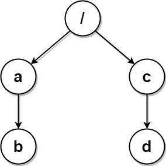

1948. Удалить дубликаты папок в системе
Жесткий
Темы
значок премиум-замка
Компании
Намекать
Из-за ошибки в файловой системе появилось много дублирующихся папок. Вам дан двумерный массив paths, где paths[i]— массив, представляющий абсолютный путь к папке в файловой системе.ith

Например, ["one", "two", "three"]представляет собой путь "/one/two/three".
Две папки (не обязательно на одном уровне) идентичны , если они содержат одинаковый непустой набор идентичных подпапок и их структуру. Для идентичности папкам не обязательно находиться на корневом уровне. Если две или более папок идентичны , отметьте эти папки и все их подпапки.

Например, папки "/a"и "/b"в приведённой ниже файловой структуре идентичны. Они (как и их подпапки) должны быть отмечены:
/a
/a/x
/a/x/y
/a/z
/b
/b/x
/b/x/y
/b/z
Однако если бы структура файла также включала путь "/b/w", то папки "/a"и "/b"не были бы идентичны. Обратите внимание, что "/a/x"папки и "/b/x"всё равно считались бы идентичными даже с добавленной папкой.
После того, как все идентичные папки и их подпапки будут отмечены, файловая система удалит их все. Файловая система выполняет удаление только один раз, поэтому папки, ставшие идентичными после первоначального удаления, не удаляются.

Верните двумерный массив ans , содержащий пути к оставшимся папкам после удаления всех отмеченных папок. Пути могут быть возвращены в любом порядке .

 

Пример 1:

Ввод: paths = [["a"],["c"],["d"],["a","b"],["c","b"],["d","a"]]
 Вывод: [["d"],["d","a"]]
 Пояснение: Структура файла показана ниже. 
Папки "/a" и "/c" (и их подпапки) отмечены для удаления, поскольку обе содержат пустую 
папку с именем "b".
Пример 2:

Ввод: paths = [["a"],["c"],["a","b"],["c","b"],["a","b","x"],["a","b","x","y"],["w"],["w","y"]]
 Вывод: [["c"],["c","b"],["a"],["a","b"]]
 Пояснение: Структура файла показана ниже. 
Папки "/a/b/x" и "/w" (и их подпапки) отмечены для удаления, поскольку обе содержат пустую папку с именем "y". 
Обратите внимание, что папки "/a" и "/c" идентичны после удаления, но они не удаляются, поскольку не были отмечены заранее.
Пример 3:

Входные данные: paths = [["a","b"],["c","d"],["c"],["a"]]
 Выходные данные: [["c"],["c","d"],["a"],["a","b"]]
 Пояснение: Все папки в файловой системе уникальны. 
Обратите внимание, что возвращаемый массив может быть в другом порядке, так как порядок не имеет значения.
 

Ограничения:

1 <= paths.length <= 2 * 104
1 <= paths[i].length <= 500
1 <= paths[i][j].length <= 10
1 <= sum(paths[i][j].length) <= 2 * 105
path[i][j]состоит из строчных английских букв.
Ни один из путей не ведет к одной и той же папке.
Для любой папки, не находящейся на корневом уровне, ее родительская папка также будет во входных данных.