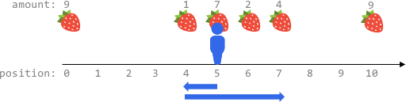

2106. Максимальное количество собранных фруктов после максимум K шагов
Жесткий
Темы
значок премиум-замка
Компании
Намекать
Фрукты доступны в некоторых позициях на бесконечной оси X. Вам дан двумерный целочисленный массив ,fruits где изображены фрукты в позиции . Он уже отсортирован по возрастанию , и каждый из них уникален .fruits[i] = [positioni, amounti]amountipositionifruitspositionipositioni

Вам также даны целое число startPosи целое число k. Изначально вы находитесь в позиции startPos. Из любой позиции вы можете сделать шаг влево или вправо . Для перемещения на одну единицу по оси X требуется один шаг , и вы можете сделать максимум шагов. В каждой достигнутой позиции вы собираете все фрукты в этой позиции, и фрукты исчезают из этой позиции. k

Верните максимальное общее количество фруктов, которое вы можете собрать .

 

Пример 1:

Вход: fruits = [[2,8],[6,3],[8,6]], startPos = 5, k = 4
 Выход: 9
 Объяснение: 
Оптимальный способ:
- Двигайтесь вправо к позиции 6 и соберите 3 фрукта.
- Двигайтесь вправо к позиции 8 и соберите 6 фруктов.
Вы продвинулись на 3 шага и собрали в общей сложности 3 + 6 = 9 фруктов.
Пример 2:

Вход: fruits = [[0,9],[4,1],[5,7],[6,2],[7,4],[10,9]], startPos = 5, k = 4
 Выход: 14
 Объяснение: 
Вы можете переместиться максимум на k = 4 шага, поэтому вы не сможете достичь позиции 0 или 10.
Оптимальный способ:
- Соберите 7 фруктов на стартовой позиции 5.
- Переместитесь влево на позицию 4 и соберите 1 фрукт.
- Двигайтесь вправо к позиции 6 и соберите 2 фрукта.
- Двигайтесь вправо к позиции 7 и соберите 4 фрукта.
Вы продвинулись на 1 + 3 = 4 шага и собрали в общей сложности 7 + 1 + 2 + 4 = 14 фруктов.
Пример 3:

Вход: fruits = [[0,3],[6,4],[8,5]], startPos = 3, k = 2
 Выход: 0
 Объяснение:
Вы можете сделать максимум k = 2 шага и не можете достичь какой-либо позиции с помощью фруктов.
 

Ограничения:

1 <= fruits.length <= 105
fruits[i].length == 2
0 <= startPos, positioni <= 2 * 105
positioni-1 < positioniдля любого i > 0 ( с индексом 0 )
1 <= amounti <= 104
0 <= k <= 2 * 105