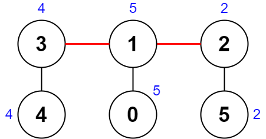

2322. Минимальный балл после удаления на дереве
Жесткий
Темы
значок премиум-замка
Компании
Намекать
Имеется неориентированное связное дерево с nузлами, помеченными от 0до, n - 1и n - 1ребрами.

Вам дан целочисленный массив с индексом 0nums , длина nкоторого nums[i]представляет значение узла. Вам также дан двумерный целочисленный массив , длина которого указывает на наличие ребра между узлами и в дереве.ithedgesn - 1edges[i] = [ai, bi]aibi

Удалим два отдельных ребра дерева, чтобы сформировать три связных компонента. Для пары удалённых ребер определены следующие шаги:

Получите XOR всех значений узлов для каждого из трех компонентов соответственно.
Разница между наибольшим значением XOR и наименьшим значением XOR представляет собой оценку пары .
Например, пусть три компонента имеют значения узлов: [4,5,7], [1,9], и [3,3,3]. Три значения XOR: , , и . Наибольшее значение XOR равно , а наименьшее значение XOR равно . Тогда оценка равна .4 ^ 5 ^ 7 = 61 ^ 9 = 83 ^ 3 ^ 3 = 3838 - 3 = 5
Верните минимальный счет любой возможной пары удалений ребер на заданном дереве .

 

Пример 1:

Вход: числа = [1,5,5,4,11], ребра = [[0,1],[1,2],[1,3],[3,4]]
 Выход: 9
 Пояснение: На диаграмме выше показан способ выполнения пары удалений. 
- Первый компонент имеет узлы [1,3,4] со значениями [5,4,11]. Его значение XOR равно 5 ^ 4 ^ 11 = 10. 
- Второй компонент имеет узел [0] со значением [1]. Его значение XOR равно 1 = 1. 
- Третий компонент имеет узел [2] со значением [5]. Его значение XOR равно 5 = 5. 
Оценка — это разница между наибольшим и наименьшим значениями XOR, которая равна 10 - 1 = 9. 
Можно показать, что никакая другая пара удалений не получит оценку меньше 9.
Пример 2:

Вход: числа = [5,5,2,4,4,2], ребра = [[0,1],[1,2],[5,2],[4,3],[1,3]]
 Выход: 0
 Пояснение: На диаграмме выше показан способ выполнения пары удалений. 
- Первый компонент содержит узлы [3,4] со значениями [4,4]. Его значение XOR равно 4 ^ 4 = 0. 
- Второй компонент содержит узлы [1,0] со значениями [5,5]. Его значение XOR равно 5 ^ 5 = 0. 
- Третий компонент содержит узлы [2,5] со значениями [2,2]. Его значение XOR равно 2 ^ 2 = 0. 
Оценка — это разница между наибольшим и наименьшим значениями XOR, которая равна 0 - 0 = 0. 
Мы не можем получить оценку меньше 0.
 

Ограничения:

n == nums.length
3 <= n <= 1000
1 <= nums[i] <= 108
edges.length == n - 1
edges[i].length == 2
0 <= ai, bi < n
ai != bi
edgesпредставляет собой допустимое дерево.