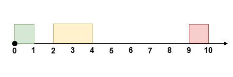

3439. Перепланируйте встречи, чтобы получить максимум свободного времени I
Середина
Темы
значок премиум-замка
Компании
Намекать
Вам дано целое число, eventTimeобозначающее длительность события, при этом событие происходит время t = 0от времени t = eventTime.

Вам также даны два целочисленных массива startTimeи endTime, каждый длиной n. Они представляют время начала и окончания n непересекающихся встреч, если встреча проходит в течение времени .ith[startTime[i], endTime[i]]

Большинство встреч можно перенести k, изменив время их начала, сохранив при этом ту же продолжительность , чтобы максимально увеличить непрерывный период свободного времени во время мероприятия.

Относительный порядок всех заседаний должен оставаться неизменным , и они не должны пересекаться.

Верните максимально возможное количество свободного времени после реорганизации встреч.

Обратите внимание , что встречи не могут быть перенесены на время, не связанное с мероприятием.

 

Пример 1:

Ввод: eventTime = 5, k = 1, startTime = [1,3], endTime = [2,5]

Выход: 2

Объяснение:

Перенести встречу на [1, 2], [2, 3]не оставляя никаких встреч в это время [0, 2].

Пример 2:

Ввод: eventTime = 10, k = 1, startTime = [0,2,9], endTime = [1,4,10]

Выход: 6

Объяснение:

Перенести встречу на [2, 4], [1, 3]не оставляя никаких встреч в это время [3, 9].

Пример 3:

Ввод: eventTime = 5, k = 2, startTime = [0,1,2,3,4], endTime = [1,2,3,4,5]

Выход: 0

Объяснение:

В ходе мероприятия нет времени, свободного от встреч.