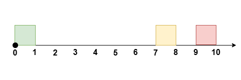
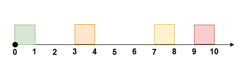

3440. Перенесите встречи, чтобы получить максимум свободного времени II
Середина
Темы
значок премиум-замка
Компании
Намекать
Вам дано целое число, eventTimeобозначающее длительность события. Вам также даны два целочисленных массива startTimeи endTime, каждый длиной n.

Они представляют собой время начала и окончания n непересекающихся встреч, которые происходят во время события между временем t = 0и временем t = eventTime, где встреча происходит в течение времениith[startTime[i], endTime[i]].

Вы можете перенести максимум одну встречу, изменив время ее начала, сохранив при этом ту же продолжительность , так, чтобы встречи не перекрывались, чтобы максимально увеличить непрерывный период свободного времени во время мероприятия.

Верните максимально возможное количество свободного времени после реорганизации встреч.

Обратите внимание , что встречи не могут быть перенесены на время, не связанное с мероприятием, и они не должны пересекаться.

Примечание: в этой версии допустимо изменение относительного порядка встреч после переноса одной встречи.

 

Пример 1:

Ввод: eventTime = 5, startTime = [1,3], endTime = [2,5]

Выход: 2

Объяснение:

Перенести встречу на [1, 2], [2, 3]не оставляя никаких встреч в это время [0, 2].

Пример 2:

Ввод: eventTime = 10, startTime = [0,7,9], endTime = [1,8,10]

Выход: 7

Объяснение:

Перенести встречу на [0, 1], [8, 9]не оставляя никаких встреч в это время [0, 7].

Пример 3:

Ввод: eventTime = 10, startTime = [0,3,7,9], endTime = [1,4,8,10]

Выход: 6

Объяснение:

Перенести встречу на [3, 4], [8, 9]не оставляя никаких встреч в это время [1, 7].

Пример 4:

Ввод: eventTime = 5, startTime = [0,1,2,3,4], endTime = [1,2,3,4,5]

Выход: 0

Объяснение:

В ходе мероприятия нет времени, свободного от встреч.

 

Ограничения:

1 <= eventTime <= 109
n == startTime.length == endTime.length
2 <= n <= 105
0 <= startTime[i] < endTime[i] <= eventTime
endTime[i] <= startTime[i + 1]где iлежит в диапазоне [0, n - 2].